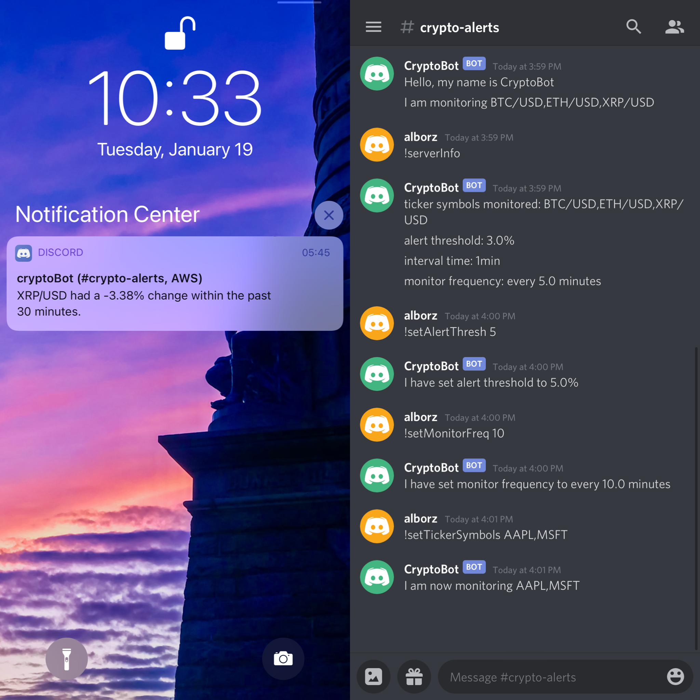

# Cryptocurrency (or stocks) Alerts using Discord

* Running on free tier AWS EC2 instance with Ubuntu 20.04
* Using free twelvedata.com APIs
* obtain api key https://twelvedata.com/register
* obtain discord bot token https://discord.com/developers/
  

## discord commands list
* !serverInfo
* !setTickerSymbols \<string>
* !setAlertThresh \<float>
* !setIntervalTime \<string> (supports 1min, 5min, 15min, 30min, 45min)
* !setMonitorFreq \<float>
* !setToDefault
